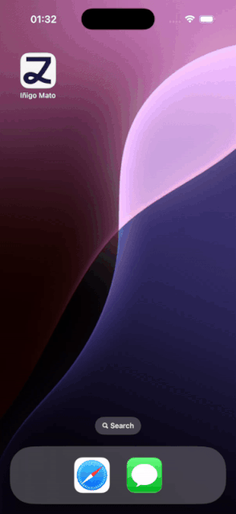
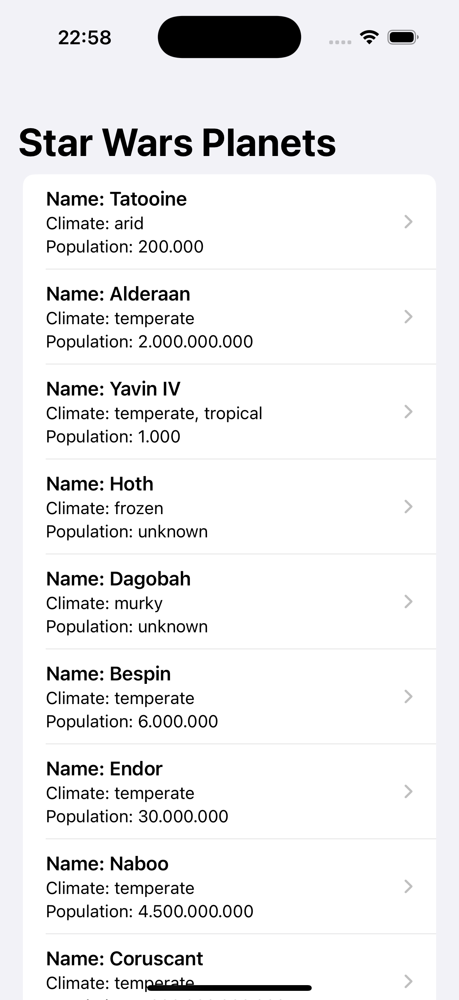
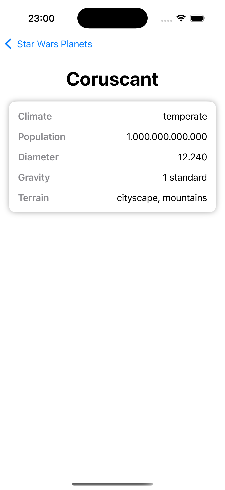

# Luzia Challenge for Inigo Mato
---

**Date:** 17 January 2025

## Task
Build an application that fetches data from the API - https://swapi.dev/api/planets/ - and displays a list of planets from the Star Wars universe.

## Requirements

### 1. Core Features
Create a SwiftUI app that displays a list of planets fetched from the Star Wars API (https://swapi.dev/api/planets/), using the first page of results.
The list should display the following details for each planet:

- Name
- Climate
- Population

### 2. Detail View
Add a detail view that is displayed when the user selects a planet from the list.
The detail view should include the following information about the selected planet:

- Name
- Climate
- Population
- Diameter
- Gravity
- Terrain

### 3. Technical Considerations

- Use SwiftUI for all user interfaces.
- Use an architecture you’re comfortable with (e.g., MVVM, MVC, etc.).
- Simple UI, we do not need to see a beautiful interface (we love wireframes ✨)

### Submission Guidelines

Submit your project as a Git repository link.

## Notes

- This assignment is designed to assess your coding style, approach to problem-solving, and ability to structure a project.

- Go simple and use a focussed approach, but take into account that you will be asked to extend on the project in the live code session so we encourage you to submit a project that reflects your coding standards.

- You may use third-party libraries, but preference is given to solutions that leverage Swift’s native frameworks.

---

## Decisions and other comments:

An MVVM architecture was chosen since it has lately become the most popular, as it works well with SwiftUI’s declarative syntax and provides a natural way to organize data flow and manage UI states.

The app aims to demonstrate a comprehensive array of Swift features relevant to the task, including enumerations, protocols, extensions, SwiftUI and its property wrappers, view modifiers, SwiftData, error handling, generics, SPM, Xcode asset management (`.xcassets`), previews, `XCTest` and unit testing.

The `SWAPI` API service [documentation](https://swapi.dev/documentation) indicated the existence of resources with attributes other than planets (films, people, species, starships and vechicles), so the code was implemented having that in mind, making it possible to easily scale the code for those resources.

Extra effort has been placed into the repositories, with a repository manager (`PlanetRepositoryManager`) being created to handle both persisted/local planets (`PlanetRepositoryPersisted`) and remote planets (`PlanetRepositoryRemote`) from the API. All of these repositories, including the manager, conform to a unified `PlanetRepository`, which, in turn, adheres to a paginable repository `PaginableRepository` type. This design is in accordance with the abstract type expected by the generic view model (`InfiniteListViewModel`).

This view model is initialized with dependencies conforming to protocols rather than concrete types. This allows for flexible dependency injection, enabling the use of mock or stub implementations in unit tests. As a result, we can isolate the view model's behavior from its dependencies, making it possible to test independently.
This approach also facilitates swapping out the repository with any other `PaginableRepository`, allowing us to adapt to different implementations with minimal code changes. By relying on protocols, we can easily inject alternative implementations, which is particularly useful for modularization, testing, and maintaining flexibility as requirements evolve.

The view utilizes a `List` to efficiently render only the rows that are visible on the screen, improving performance. 
The view in charge of showing the planets (`PlanetListView`) is also refreshable and shows a loading overlay while doing so.
A `NetworkManager` feature was implemented to enhance user awareness of connectivity issues.

Some unit tests were also developed for the `InfiniteListViewModel`, as well as one of the planet repositories created (`PlanetRepositoryPersisted`).

Future enhancements could include improving error handling, cancelling ongoing requests if needed, test coverage, UI tests.

